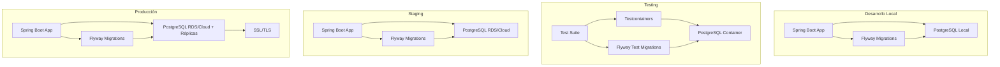

# Documento de Diseño: Migración de Base de Datos

## Visión General

Este diseño establece la migración completa de la configuración de base de datos del proyecto Atleta-Server desde H2 en memoria a PostgreSQL con Flyway para migraciones, configuraciones optimizadas por ambiente, y estrategias de testing robustas. La solución implementa configuraciones específicas para desarrollo, testing, staging y producción, con énfasis en seguridad, rendimiento y mantenibilidad.

## Arquitectura

### Arquitectura de Base de Datos por Ambientes



### Stack Tecnológico

- **Base de Datos**: PostgreSQL 16.x (última versión estable)
- **Driver**: PostgreSQL JDBC Driver 42.7.7 (última versión estable de la serie 42.7.x)
- **ORM**: Hibernate 6.x (incluido en Spring Boot 3.4.1)
- **Migraciones**: Flyway 10.10.0 (última versión estable)
- **Pool de Conexiones**: HikariCP (por defecto en Spring Boot 3.4.1)
- **Testing**: Testcontainers 1.19.x (con soporte nativo en Spring Boot 3.4.1)
- **Monitoreo**: Spring Boot Actuator + Micrometer

## Componentes e Interfaces

### 1. Configuración de Dependencias

**pom.xml - Nuevas Dependencias**:
```xml
<!-- PostgreSQL Driver - Versión más reciente estable -->
<dependency>
    <groupId>org.postgresql</groupId>
    <artifactId>postgresql</artifactId>
    <version>42.7.7</version>
    <scope>runtime</scope>
</dependency>

<!-- Flyway para migraciones - Versión más reciente estable -->
<dependency>
    <groupId>org.flywaydb</groupId>
    <artifactId>flyway-core</artifactId>
    <version>10.10.0</version>
</dependency>

<!-- Flyway PostgreSQL específico -->
<dependency>
    <groupId>org.flywaydb</groupId>
    <artifactId>flyway-database-postgresql</artifactId>
    <version>10.10.0</version>
</dependency>

<!-- Testcontainers para testing - Soporte nativo en Spring Boot 3.4.1 -->
<dependency>
    <groupId>org.springframework.boot</groupId>
    <artifactId>spring-boot-testcontainers</artifactId>
    <scope>test</scope>
</dependency>

<dependency>
    <groupId>org.testcontainers</groupId>
    <artifactId>postgresql</artifactId>
    <scope>test</scope>
</dependency>

<!-- Testcontainers JUnit 5 integration -->
<dependency>
    <groupId>org.testcontainers</groupId>
    <artifactId>junit-jupiter</artifactId>
    <scope>test</scope>
</dependency>
```

### 2. Configuraciones por Ambiente

**application-dev.yaml (Desarrollo)**:
```yaml
spring:
  datasource:
    url: jdbc:postgresql://localhost:5432/atleta_dev
    username: ${DB_USERNAME:atleta_dev}
    password: ${DB_PASSWORD:dev_password}
    driver-class-name: org.postgresql.Driver
    hikari:
      maximum-pool-size: 10
      minimum-idle: 5
      idle-timeout: 300000
      connection-timeout: 20000
      leak-detection-threshold: 60000
      connection-test-query: SELECT 1
      
  jpa:
    database-platform: org.hibernate.dialect.PostgreSQLDialect
    hibernate:
      ddl-auto: validate  # Solo validar, Flyway maneja el esquema
    properties:
      hibernate:
        show_sql: true
        format_sql: true
        use_sql_comments: true
        jdbc:
          lob:
            non_contextual_creation: true
        query:
          timeout: 30000
          
  flyway:
    enabled: true
    locations: classpath:db/migration
    baseline-on-migrate: true
    validate-on-migrate: true
    clean-disabled: false  # Permitir clean en desarrollo
    schemas: public
    table: flyway_schema_history
    
logging:
  level:
    org.hibernate.SQL: DEBUG
    org.hibernate.type.descriptor.sql.BasicBinder: TRACE
    org.flywaydb: DEBUG
```

**application-test.yaml (Testing)**:
```yaml
spring:
  datasource:
    # Configuración será sobrescrita por Testcontainers
    url: jdbc:postgresql://localhost:5432/test_db
    username: test
    password: test
    driver-class-name: org.postgresql.Driver
    hikari:
      maximum-pool-size: 5
      minimum-idle: 2
      connection-timeout: 10000
      
  jpa:
    database-platform: org.hibernate.dialect.PostgreSQLDialect
    hibernate:
      ddl-auto: validate
    properties:
      hibernate:
        show_sql: false
        format_sql: false
        jdbc:
          lob:
            non_contextual_creation: true
            
  flyway:
    enabled: true
    locations: classpath:db/migration, classpath:db/test-data
    clean-disabled: false
    baseline-on-migrate: true
    
logging:
  level:
    org.hibernate.SQL: WARN
    org.flywaydb: INFO
    org.testcontainers: INFO
```

**application-staging.yaml (Staging)**:
```yaml
spring:
  datasource:
    url: jdbc:postgresql://${DB_HOST:staging-db.atleta.com}:${DB_PORT:5432}/${DB_NAME:atleta_staging}
    username: ${DB_USERNAME:atleta_staging}
    password: ${DB_PASSWORD}
    driver-class-name: org.postgresql.Driver
    hikari:
      maximum-pool-size: 20
      minimum-idle: 10
      idle-timeout: 600000
      connection-timeout: 30000
      leak-detection-threshold: 60000
      connection-test-query: SELECT 1
      
  jpa:
    database-platform: org.hibernate.dialect.PostgreSQLDialect
    hibernate:
      ddl-auto: validate
    properties:
      hibernate:
        show_sql: false
        format_sql: false
        jdbc:
          lob:
            non_contextual_creation: true
        query:
          timeout: 60000
          
  flyway:
    enabled: true
    locations: classpath:db/migration
    baseline-on-migrate: false
    validate-on-migrate: true
    clean-disabled: true  # Seguridad: no permitir clean
    schemas: public
    table: flyway_schema_history
    
logging:
  level:
    org.hibernate.SQL: WARN
    org.flywaydb: INFO
    com.atleta.demo: INFO
```

**application-prod.yaml (Producción)**:
```yaml
spring:
  datasource:
    url: jdbc:postgresql://${DB_HOST}:${DB_PORT:5432}/${DB_NAME}?ssl=true&sslmode=require
    username: ${DB_USERNAME}
    password: ${DB_PASSWORD}
    driver-class-name: org.postgresql.Driver
    hikari:
      maximum-pool-size: 50
      minimum-idle: 20
      idle-timeout: 600000
      connection-timeout: 30000
      leak-detection-threshold: 60000
      connection-test-query: SELECT 1
      pool-name: HikariPool-Atleta-Production
      register-mbeans: true
      
  jpa:
    database-platform: org.hibernate.dialect.PostgreSQLDialect
    hibernate:
      ddl-auto: validate
    properties:
      hibernate:
        show_sql: false
        format_sql: false
        jdbc:
          lob:
            non_contextual_creation: true
          batch_size: 25
        order_inserts: true
        order_updates: true
        query:
          timeout: 60000
          
  flyway:
    enabled: true
    locations: classpath:db/migration
    baseline-on-migrate: false
    validate-on-migrate: true
    clean-disabled: true
    schemas: public
    table: flyway_schema_history
    connect-retries: 3
    
logging:
  level:
    org.hibernate.SQL: WARN
    org.flywaydb: INFO
    com.atleta.demo: INFO
    root: WARN
```

### 3. Estructura de Migraciones Flyway

**Convenciones de Nomenclatura**:
```
V{VERSION}__{DESCRIPTION}.sql

Ejemplos:
V001__create_initial_schema.sql
V002__add_indexes_performance.sql
V003__insert_initial_data.sql
V004__add_trust_score_constraints.sql
```

**Estructura de Directorios**:
```
src/main/resources/
├── db/
│   ├── migration/           # Migraciones principales
│   │   ├── V001__create_initial_schema.sql
│   │   ├── V002__add_indexes_performance.sql
│   │   ├── V003__insert_initial_data.sql
│   │   └── V004__add_constraints.sql
│   ├── test-data/          # Datos de prueba
│   │   ├── V900__insert_test_athletes.sql
│   │   └── V901__insert_test_teams.sql
│   └── callbacks/          # Scripts de callback
│       ├── beforeMigrate.sql
│       └── afterMigrate.sql
```

### 4. Configuración de Testing con Testcontainers

**TestDatabaseConfig.java**:
```java
@TestConfiguration
public class TestDatabaseConfig {
    
    @Bean
    @ServiceConnection
    static PostgreSQLContainer<?> postgreSQLContainer() {
        return new PostgreSQLContainer<>("postgres:16")
                .withDatabaseName("atleta_test")
                .withUsername("test")
                .withPassword("test")
                .withInitScript("test-init.sql");
    }
}
```

**BaseIntegrationTest.java**:
```java
@SpringBootTest
@Testcontainers
@ActiveProfiles("test")
public abstract class BaseIntegrationTest {
    
    @Container
    @ServiceConnection
    static PostgreSQLContainer<?> postgres = new PostgreSQLContainer<>("postgres:16")
            .withDatabaseName("atleta_test")
            .withUsername("test")
            .withPassword("test");
    
    @DynamicPropertySource
    static void configureProperties(DynamicPropertyRegistry registry) {
        registry.add("spring.datasource.url", postgres::getJdbcUrl);
        registry.add("spring.datasource.username", postgres::getUsername);
        registry.add("spring.datasource.password", postgres::getPassword);
    }
}
```

### 5. Configuración de Monitoreo y Métricas

**DatabaseMetricsConfig.java**:
```java
@Configuration
@ConditionalOnProperty(name = "management.metrics.export.prometheus.enabled", havingValue = "true")
public class DatabaseMetricsConfig {
    
    @Bean
    public MeterBinder hikariMetrics(@Autowired DataSource dataSource) {
        if (dataSource instanceof HikariDataSource hikariDataSource) {
            return new HikariCPMetrics(hikariDataSource, "hikari", Collections.emptyList());
        }
        return registry -> {};
    }
    
    @EventListener
    public void handleApplicationReady(ApplicationReadyEvent event) {
        // Registrar métricas personalizadas de base de datos
        registerCustomDatabaseMetrics();
    }
    
    private void registerCustomDatabaseMetrics() {
        // Implementar métricas específicas del dominio Atleta
    }
}
```

**application.yaml - Configuración de Actuator**:
```yaml
management:
  endpoints:
    web:
      exposure:
        include: health,info,metrics,flyway,datasource
  endpoint:
    health:
      show-details: when-authorized
      show-components: always
  metrics:
    export:
      prometheus:
        enabled: true
  health:
    db:
      enabled: true
```

## Modelos de Datos

### Migraciones del Esquema Atleta

**V001__create_initial_schema.sql**:
```sql
-- Crear esquema inicial para aplicación Atleta
-- Versión: V001
-- Descripción: Esquema base con todas las entidades del dominio Atleta

-- Habilitar extensiones necesarias
CREATE EXTENSION IF NOT EXISTS "uuid-ossp";
CREATE EXTENSION IF NOT EXISTS pg_trgm;

-- Tabla de atletas (identidad global)
CREATE TABLE athletes (
    atleta_uuid         UUID PRIMARY KEY DEFAULT uuid_generate_v4(),
    email              VARCHAR(255) NOT NULL UNIQUE,
    password_hash      VARCHAR(255) NOT NULL,
    nombre             VARCHAR(100) NOT NULL,
    created_at         TIMESTAMP(0) NOT NULL DEFAULT NOW(),
    updated_at         TIMESTAMP(0),
    version            INTEGER NOT NULL DEFAULT 0
);

-- Tabla de posiciones (catálogo fijo)
CREATE TABLE positions (
    id                 BIGSERIAL PRIMARY KEY,
    nombre             VARCHAR(50) NOT NULL UNIQUE,
    created_at         TIMESTAMP(0) NOT NULL DEFAULT NOW(),
    updated_at         TIMESTAMP(0),
    version            INTEGER NOT NULL DEFAULT 0
);

-- Tabla de perfiles de jugador (contexto fútbol)
CREATE TABLE player_profile (
    atleta_uuid        UUID PRIMARY KEY REFERENCES athletes(atleta_uuid),
    alias              VARCHAR(50),
    trust_score        INTEGER NOT NULL DEFAULT 100,
    created_at         TIMESTAMP(0) NOT NULL DEFAULT NOW(),
    updated_at         TIMESTAMP(0),
    version            INTEGER NOT NULL DEFAULT 0
);

-- Tabla de posiciones de jugador (N-M con prioridades)
CREATE TABLE player_positions (
    id                 BIGSERIAL PRIMARY KEY,
    user_id            UUID NOT NULL REFERENCES player_profile(atleta_uuid),
    position_id        BIGINT NOT NULL REFERENCES positions(id),
    prioridad          INTEGER NOT NULL CHECK (prioridad BETWEEN 1 AND 3),
    xp                 INTEGER NOT NULL DEFAULT 0 CHECK (xp >= 0),
    created_at         TIMESTAMP(0) NOT NULL DEFAULT NOW(),
    updated_at         TIMESTAMP(0),
    version            INTEGER NOT NULL DEFAULT 0,
    UNIQUE(user_id, position_id),
    UNIQUE(user_id, prioridad)
);

-- Tabla de equipos
CREATE TABLE teams (
    id                 BIGSERIAL PRIMARY KEY,
    nombre             VARCHAR(100) NOT NULL UNIQUE,
    logo_url           VARCHAR(500),
    anio_fundacion     INTEGER,
    creador_user_id    UUID NOT NULL REFERENCES player_profile(atleta_uuid),
    created_at         TIMESTAMP(0) NOT NULL DEFAULT NOW(),
    updated_at         TIMESTAMP(0),
    version            INTEGER NOT NULL DEFAULT 0
);

-- Tabla de estadísticas de equipo
CREATE TABLE team_stats (
    id                 BIGSERIAL PRIMARY KEY,
    team_id            BIGINT NOT NULL UNIQUE REFERENCES teams(id),
    partidos_jugados   INTEGER NOT NULL DEFAULT 0,
    partidos_ganados   INTEGER NOT NULL DEFAULT 0,
    partidos_perdidos  INTEGER NOT NULL DEFAULT 0,
    partidos_empatados INTEGER NOT NULL DEFAULT 0,
    goles_favor        INTEGER NOT NULL DEFAULT 0,
    goles_contra       INTEGER NOT NULL DEFAULT 0,
    created_at         TIMESTAMP(0) NOT NULL DEFAULT NOW(),
    updated_at         TIMESTAMP(0),
    version            INTEGER NOT NULL DEFAULT 0
);

-- Tabla de miembros de equipo (N-M)
CREATE TABLE team_members (
    id                 BIGSERIAL PRIMARY KEY,
    team_id            BIGINT NOT NULL REFERENCES teams(id),
    user_id            UUID NOT NULL REFERENCES player_profile(atleta_uuid),
    rol                VARCHAR(20) NOT NULL CHECK (rol IN ('JUGADOR', 'CAPITAN', 'DT')),
    activo             BOOLEAN NOT NULL DEFAULT true,
    joined_at          TIMESTAMP(0) NOT NULL DEFAULT NOW(),
    created_at         TIMESTAMP(0) NOT NULL DEFAULT NOW(),
    updated_at         TIMESTAMP(0),
    version            INTEGER NOT NULL DEFAULT 0,
    UNIQUE(team_id, user_id)
);

-- Tabla de partidos
CREATE TABLE matches (
    id                      BIGSERIAL PRIMARY KEY,
    modalidad              VARCHAR(10) NOT NULL CHECK (modalidad IN ('5v5', '6v6', '7v7')),
    fecha_hora_programada  TIMESTAMP(0) NOT NULL,
    latitud                DECIMAL(10,8) CHECK (latitud BETWEEN -90 AND 90),
    longitud               DECIMAL(11,8) CHECK (longitud BETWEEN -180 AND 180),
    cuota                  DECIMAL(10,2) CHECK (cuota >= 0),
    creador_user_id        UUID NOT NULL REFERENCES player_profile(atleta_uuid),
    estado                 VARCHAR(20) NOT NULL DEFAULT 'CREADO' CHECK (estado IN ('CREADO', 'INICIADO', 'FINALIZADO', 'INVALIDO')),
    started_at             TIMESTAMP(0),
    created_at             TIMESTAMP(0) NOT NULL DEFAULT NOW(),
    updated_at             TIMESTAMP(0),
    version                INTEGER NOT NULL DEFAULT 0
);

-- Tabla de equipos en partido (1 partido - 2 equipos exactamente)
CREATE TABLE match_teams (
    id                 BIGSERIAL PRIMARY KEY,
    match_id           BIGINT NOT NULL REFERENCES matches(id),
    team_id            BIGINT NOT NULL REFERENCES teams(id),
    es_local           BOOLEAN NOT NULL,
    goles              INTEGER NOT NULL DEFAULT 0 CHECK (goles >= 0),
    created_at         TIMESTAMP(0) NOT NULL DEFAULT NOW(),
    updated_at         TIMESTAMP(0),
    version            INTEGER NOT NULL DEFAULT 0,
    UNIQUE(match_id, team_id),
    UNIQUE(match_id, es_local)
);

-- Tabla de jugadores en partido (N-M)
CREATE TABLE match_players (
    id                 BIGSERIAL PRIMARY KEY,
    match_id           BIGINT NOT NULL REFERENCES matches(id),
    team_id            BIGINT NOT NULL REFERENCES teams(id),
    user_id            UUID NOT NULL REFERENCES player_profile(atleta_uuid),
    position_id        BIGINT NOT NULL REFERENCES positions(id),
    rol                VARCHAR(20) NOT NULL CHECK (rol IN ('JUGADOR', 'CAPITAN', 'DT')),
    confirmado         BOOLEAN NOT NULL DEFAULT false,
    created_at         TIMESTAMP(0) NOT NULL DEFAULT NOW(),
    updated_at         TIMESTAMP(0),
    version            INTEGER NOT NULL DEFAULT 0,
    UNIQUE(match_id, user_id)
);

-- Tabla de eventos de partido
CREATE TABLE match_events (
    id                 BIGSERIAL PRIMARY KEY,
    match_id           BIGINT NOT NULL REFERENCES matches(id),
    team_id            BIGINT NOT NULL REFERENCES teams(id),
    player_id          UUID NOT NULL REFERENCES player_profile(atleta_uuid),
    event_type         VARCHAR(20) NOT NULL CHECK (event_type IN ('GOL', 'ASISTENCIA')),
    assist_player_id   UUID REFERENCES player_profile(atleta_uuid),
    confirmed_by_local BOOLEAN NOT NULL DEFAULT false,
    confirmed_by_visitor BOOLEAN NOT NULL DEFAULT false,
    created_at         TIMESTAMP(0) NOT NULL DEFAULT NOW(),
    updated_at         TIMESTAMP(0),
    version            INTEGER NOT NULL DEFAULT 0
);

-- Tabla de historial de jugador (fuente de verdad - inmutable)
CREATE TABLE player_history (
    id                 BIGSERIAL PRIMARY KEY,
    match_id           BIGINT NOT NULL REFERENCES matches(id),
    user_id            UUID NOT NULL REFERENCES player_profile(atleta_uuid),
    team_id            BIGINT NOT NULL REFERENCES teams(id),
    position_id        BIGINT NOT NULL REFERENCES positions(id),
    goles              INTEGER NOT NULL DEFAULT 0,
    asistencias        INTEGER NOT NULL DEFAULT 0,
    resultado          VARCHAR(20) NOT NULL CHECK (resultado IN ('VICTORIA', 'DERROTA', 'EMPATE')),
    xp_ganada          INTEGER NOT NULL DEFAULT 0,
    created_at         TIMESTAMP(0) NOT NULL DEFAULT NOW()
    -- Nota: No tiene updated_at ni version porque es inmutable
);

-- Tabla de logs de confianza
CREATE TABLE trust_logs (
    id                 BIGSERIAL PRIMARY KEY,
    user_id            UUID NOT NULL REFERENCES player_profile(atleta_uuid),
    match_id           BIGINT REFERENCES matches(id),
    cambio             INTEGER NOT NULL,
    motivo             VARCHAR(255) NOT NULL,
    created_at         TIMESTAMP(0) NOT NULL DEFAULT NOW(),
    updated_at         TIMESTAMP(0),
    version            INTEGER NOT NULL DEFAULT 0
);

-- Comentarios para documentación
COMMENT ON TABLE athletes IS 'Tabla de atletas con identidad global única';
COMMENT ON TABLE player_profile IS 'Perfiles específicos de fútbol asociados a atletas';
COMMENT ON TABLE positions IS 'Catálogo fijo de posiciones de fútbol';
COMMENT ON TABLE teams IS 'Equipos de fútbol con información básica';
COMMENT ON TABLE matches IS 'Partidos de fútbol con modalidades específicas';
COMMENT ON TABLE player_history IS 'Historial inmutable de participaciones - FUENTE DE VERDAD';
```

**V002__add_indexes_performance.sql**:
```sql
-- Agregar índices para optimización de performance
-- Versión: V002
-- Descripción: Índices adicionales para consultas frecuentes del dominio Atleta

-- Índices básicos para búsquedas frecuentes
CREATE INDEX idx_athletes_email ON athletes(email);
CREATE INDEX idx_player_profile_trust_score ON player_profile(trust_score);
CREATE INDEX idx_teams_nombre ON teams(nombre);
CREATE INDEX idx_matches_estado ON matches(estado);
CREATE INDEX idx_matches_fecha ON matches(fecha_hora_programada);

-- Índices compuestos para consultas comunes
CREATE INDEX idx_team_members_team_active ON team_members(team_id, activo);
CREATE INDEX idx_match_players_match_confirmed ON match_players(match_id, confirmado);
CREATE INDEX idx_match_events_match_type ON match_events(match_id, event_type);
CREATE INDEX idx_player_history_user_match ON player_history(user_id, match_id);

-- Índices para búsquedas geográficas
CREATE INDEX idx_matches_location ON matches(latitud, longitud) WHERE latitud IS NOT NULL AND longitud IS NOT NULL;

-- Índices para búsquedas de texto
CREATE INDEX idx_athletes_nombre_trgm ON athletes USING gin(nombre gin_trgm_ops);
CREATE INDEX idx_teams_nombre_trgm ON teams USING gin(nombre gin_trgm_ops);

-- Índices para relaciones frecuentes
CREATE INDEX idx_player_positions_user ON player_positions(user_id);
CREATE INDEX idx_trust_logs_user_date ON trust_logs(user_id, created_at);
CREATE INDEX idx_match_teams_match ON match_teams(match_id);
```

**V003__insert_initial_data.sql**:
```sql
-- Insertar datos iniciales del sistema Atleta
-- Versión: V003
-- Descripción: Datos maestros y configuración inicial

-- Posiciones de fútbol (catálogo fijo)
INSERT INTO positions (nombre) VALUES
('Portero'),
('Defensa'),
('Carrilero'),
('Mediocampista'),
('Delantero'),
('DT');

-- Atleta administrador por defecto
INSERT INTO athletes (atleta_uuid, email, password_hash, nombre)
VALUES (
    uuid_generate_v4(),
    'admin@atleta.com',
    '$2a$10$encrypted_password_hash_here',
    'Administrador Sistema'
);

-- Perfil de jugador para el administrador
INSERT INTO player_profile (atleta_uuid, alias, trust_score)
SELECT atleta_uuid, 'Admin', 100
FROM athletes
WHERE email = 'admin@atleta.com';
```

## Propiedades de Corrección

*Una propiedad es una característica o comportamiento que debe mantenerse verdadero en todas las ejecuciones válidas de un sistema, esencialmente, una declaración formal sobre lo que el sistema debe hacer. Las propiedades sirven como puente entre especificaciones legibles por humanos y garantías de corrección verificables por máquinas.*

Después de revisar todas las propiedades identificadas como testeables, realizaré una reflexión para eliminar redundancias:

**Reflexión de Propiedades:**
- Las propiedades 1.1, 1.3, 1.4 pueden combinarse en una propiedad más comprehensiva sobre configuraciones por ambiente
- Las propiedades 3.1, 3.2, 3.3, 3.4 pueden combinarse en una propiedad sobre configuración de pools por ambiente
- Las propiedades 6.1, 6.3, 6.4 pueden combinarse en una propiedad sobre configuraciones de seguridad
- Las propiedades 9.1, 9.2, 9.3, 9.4 pueden combinarse en una propiedad sobre configuración de logging por ambiente

### Propiedades de Corrección

**Propiedad 1: Configuraciones específicas por ambiente**
*Para cualquier* ambiente (dev, test, staging, prod), las configuraciones de base de datos deben ser apropiadas para ese contexto específico, incluyendo URLs, pools de conexión y configuraciones de seguridad
**Valida: Requisitos 1.1, 1.3, 1.4, 3.1, 3.2, 3.3, 3.4**

**Propiedad 2: Uso de Testcontainers en testing**
*Para cualquier* ejecución de tests, el sistema debe usar Testcontainers con PostgreSQL para aislamiento completo, no otras fuentes de datos
**Valida: Requisitos 1.2, 5.1, 5.2, 5.5**

**Propiedad 3: Seguridad de credenciales**
*Para cualquier* configuración de ambiente, las credenciales deben obtenerse exclusivamente de variables de entorno, sin valores hardcodeados
**Valida: Requisitos 1.5, 6.3**

**Propiedad 4: Ejecución automática de migraciones**
*Para cualquier* inicialización de aplicación, Flyway debe ejecutar automáticamente las migraciones pendientes y mantener el historial en flyway_schema_history
**Valida: Requisitos 2.1, 2.2**

**Propiedad 5: Convenciones de nomenclatura de migraciones**
*Para cualquier* archivo de migración, debe seguir la convención V{VERSION}__{DESCRIPTION}.sql y ser validado antes de aplicarse
**Valida: Requisitos 2.3, 2.4**

**Propiedad 6: Configuraciones de seguridad en producción**
*Para cualquier* configuración de producción, debe incluir SSL obligatorio, clean de Flyway deshabilitado, y timeouts apropiados
**Valida: Requisitos 2.5, 6.1, 6.4**

**Propiedad 7: Integridad del esquema después de migraciones**
*Para cualquier* ejecución de migraciones iniciales, deben crearse todas las tablas del dominio Atleta con índices, constraints y datos maestros
**Valida: Requisitos 4.1, 4.2, 4.3, 4.4, 4.5**

**Propiedad 8: Aislamiento de datos en testing**
*Para cualquier* test individual, los datos deben limpiarse después de la ejecución pero el esquema debe mantenerse, permitiendo datos de prueba específicos
**Valida: Requisitos 5.3, 5.4**

**Propiedad 9: Exposición de métricas de base de datos**
*Para cualquier* aplicación inicializada, las métricas de HikariCP (conexiones activas, idle, totales) deben estar disponibles via Actuator
**Valida: Requisitos 7.1, 7.2, 7.4**

**Propiedad 10: Funcionalidad de scripts de backup**
*Para cualquier* ejecución de backup, deben generarse archivos separados (completo, esquema, datos) con compresión, fechado y validación de integridad
**Valida: Requisitos 8.1, 8.2, 8.4**

**Propiedad 11: Scripts de restauración funcionales**
*Para cualquier* archivo de backup válido, los scripts de restore deben poder restaurar la base de datos correctamente con rotación automática de archivos antiguos
**Valida: Requisitos 8.3, 8.5**

**Propiedad 12: Configuración de logging por ambiente**
*Para cualquier* ambiente específico, el logging de base de datos debe estar configurado apropiadamente (detallado en dev, errores en prod, etc.)
**Valida: Requisitos 9.1, 9.2, 9.3, 9.4, 9.5**

**Propiedad 13: Validación de configuraciones al startup**
*Para cualquier* inicio de aplicación, deben validarse variables de entorno requeridas, conectividad de base de datos, y consistencia de migraciones
**Valida: Requisitos 10.1, 10.2, 10.3, 10.4, 10.5**

<function_calls>
<invoke name="prework">
<parameter name="featureName">database-migration

### 6. Scripts de Backup y Recuperación

**backup-database.sh**:
```bash
#!/bin/bash
# Script de backup para base de datos Atleta
# Uso: ./backup-database.sh <ambiente> [fecha]

ENVIRONMENT=${1:-dev}
BACKUP_DATE=${2:-$(date +%Y%m%d_%H%M%S)}
BACKUP_DIR="/backups/atleta/${ENVIRONMENT}/${BACKUP_DATE}"

# Configuración por ambiente
case $ENVIRONMENT in
    "dev")
        DB_HOST="localhost"
        DB_NAME="atleta_dev"
        DB_USER="atleta_dev"
        ;;
    "staging")
        DB_HOST="${STAGING_DB_HOST}"
        DB_NAME="${STAGING_DB_NAME}"
        DB_USER="${STAGING_DB_USER}"
        ;;
    "prod")
        DB_HOST="${PROD_DB_HOST}"
        DB_NAME="${PROD_DB_NAME}"
        DB_USER="${PROD_DB_USER}"
        ;;
    *)
        echo "Ambiente no válido: $ENVIRONMENT"
        exit 1
        ;;
esac

mkdir -p $BACKUP_DIR

echo "Iniciando backup para ambiente: $ENVIRONMENT"

# Backup completo
pg_dump -h $DB_HOST -U $DB_USER -d $DB_NAME \
  --verbose --clean --no-owner --no-privileges \
  --format=custom \
  --file="$BACKUP_DIR/atleta_full_backup.dump"

# Backup solo esquema
pg_dump -h $DB_HOST -U $DB_USER -d $DB_NAME \
  --schema-only --verbose --clean --no-owner --no-privileges \
  --format=plain \
  --file="$BACKUP_DIR/atleta_schema_backup.sql"

# Backup solo datos
pg_dump -h $DB_HOST -U $DB_USER -d $DB_NAME \
  --data-only --verbose --no-owner --no-privileges \
  --format=custom \
  --file="$BACKUP_DIR/atleta_data_backup.dump"

# Comprimir archivos
gzip "$BACKUP_DIR/atleta_schema_backup.sql"

# Validar integridad
pg_restore --list "$BACKUP_DIR/atleta_full_backup.dump" > /dev/null
if [ $? -eq 0 ]; then
    echo "Backup completado exitosamente en: $BACKUP_DIR"
else
    echo "Error en la validación del backup"
    exit 1
fi

# Rotación de archivos (mantener últimos 7 días)
find "/backups/atleta/${ENVIRONMENT}" -type d -mtime +7 -exec rm -rf {} \;
```

**restore-database.sh**:
```bash
#!/bin/bash
# Script de restauración para base de datos Atleta
# Uso: ./restore-database.sh <ambiente> <tipo> <archivo_backup>

ENVIRONMENT=${1}
RESTORE_TYPE=${2}  # full, schema, data
BACKUP_FILE=${3}

if [ -z "$ENVIRONMENT" ] || [ -z "$RESTORE_TYPE" ] || [ -z "$BACKUP_FILE" ]; then
    echo "Uso: $0 <ambiente> <tipo> <archivo_backup>"
    echo "Tipos: full, schema, data"
    exit 1
fi

# Configuración por ambiente
case $ENVIRONMENT in
    "dev")
        DB_HOST="localhost"
        DB_NAME="atleta_dev"
        DB_USER="atleta_dev"
        ;;
    "staging")
        DB_HOST="${STAGING_DB_HOST}"
        DB_NAME="${STAGING_DB_NAME}"
        DB_USER="${STAGING_DB_USER}"
        ;;
    *)
        echo "Restauración solo permitida en dev y staging"
        exit 1
        ;;
esac

echo "Iniciando restauración $RESTORE_TYPE para ambiente: $ENVIRONMENT"

case $RESTORE_TYPE in
    "full")
        pg_restore -h $DB_HOST -U $DB_USER -d $DB_NAME \
          --verbose --clean --no-owner --no-privileges \
          --format=custom \
          $BACKUP_FILE
        ;;
    "schema")
        psql -h $DB_HOST -U $DB_USER -d $DB_NAME -f $BACKUP_FILE
        ;;
    "data")
        pg_restore -h $DB_HOST -U $DB_USER -d $DB_NAME \
          --verbose --data-only --no-owner --no-privileges \
          --format=custom \
          $BACKUP_FILE
        ;;
    *)
        echo "Tipo de restauración no válido: $RESTORE_TYPE"
        exit 1
        ;;
esac

echo "Restauración completada"
```

### 7. Configuración de Validación al Startup

**DatabaseConfigurationValidator.java**:
```java
@Component
@Order(Ordered.HIGHEST_PRECEDENCE)
public class DatabaseConfigurationValidator implements ApplicationRunner {
    
    private static final Logger logger = LoggerFactory.getLogger(DatabaseConfigurationValidator.class);
    
    @Autowired
    private DataSource dataSource;
    
    @Autowired
    private Environment environment;
    
    @Override
    public void run(ApplicationArguments args) throws Exception {
        validateEnvironmentVariables();
        validateDatabaseConnectivity();
        validateFlywayConfiguration();
        logger.info("Validación de configuración de base de datos completada exitosamente");
    }
    
    private void validateEnvironmentVariables() {
        String[] activeProfiles = environment.getActiveProfiles();
        
        for (String profile : activeProfiles) {
            switch (profile) {
                case "prod":
                    validateRequiredEnvVar("DB_HOST", "Host de base de datos requerido para producción");
                    validateRequiredEnvVar("DB_USERNAME", "Usuario de base de datos requerido para producción");
                    validateRequiredEnvVar("DB_PASSWORD", "Contraseña de base de datos requerida para producción");
                    break;
                case "staging":
                    validateRequiredEnvVar("DB_HOST", "Host de base de datos requerido para staging");
                    validateRequiredEnvVar("DB_USERNAME", "Usuario de base de datos requerido para staging");
                    validateRequiredEnvVar("DB_PASSWORD", "Contraseña de base de datos requerida para staging");
                    break;
                // dev y test pueden usar valores por defecto
            }
        }
    }
    
    private void validateRequiredEnvVar(String varName, String message) {
        String value = environment.getProperty(varName);
        if (value == null || value.trim().isEmpty()) {
            throw new IllegalStateException(message + ": " + varName);
        }
    }
    
    private void validateDatabaseConnectivity() {
        try (Connection connection = dataSource.getConnection()) {
            if (!connection.isValid(5)) {
                throw new IllegalStateException("Conexión a base de datos no válida");
            }
            logger.info("Conectividad de base de datos validada exitosamente");
        } catch (SQLException e) {
            throw new IllegalStateException("Error al validar conectividad de base de datos", e);
        }
    }
    
    private void validateFlywayConfiguration() {
        // Validar que Flyway esté configurado correctamente
        String flywayEnabled = environment.getProperty("spring.flyway.enabled", "true");
        if (!"true".equals(flywayEnabled)) {
            logger.warn("Flyway está deshabilitado - las migraciones no se ejecutarán");
        }
        
        String[] activeProfiles = environment.getActiveProfiles();
        for (String profile : activeProfiles) {
            if ("prod".equals(profile)) {
                String cleanDisabled = environment.getProperty("spring.flyway.clean-disabled", "false");
                if (!"true".equals(cleanDisabled)) {
                    throw new IllegalStateException("Flyway clean debe estar deshabilitado en producción");
                }
            }
        }
    }
}
```

## Manejo de Errores

### Jerarquía de Excepciones de Base de Datos

```java
DatabaseException (RuntimeException)
├── DatabaseConnectionException
├── MigrationException
├── BackupException
└── ConfigurationValidationException
```

### Manejo Global de Errores de Base de Datos

```java
@ControllerAdvice
public class DatabaseExceptionHandler {
    
    private static final Logger logger = LoggerFactory.getLogger(DatabaseExceptionHandler.class);
    
    @ExceptionHandler(DataAccessException.class)
    public ResponseEntity<ErrorResponse> handleDataAccessException(DataAccessException ex) {
        logger.error("Error de acceso a datos", ex);
        
        ErrorResponse error = ErrorResponse.builder()
            .timestamp(Instant.now())
            .status(HttpStatus.INTERNAL_SERVER_ERROR.value())
            .error("Database Error")
            .message("Error interno de base de datos")
            .build();
            
        return ResponseEntity.status(HttpStatus.INTERNAL_SERVER_ERROR).body(error);
    }
    
    @ExceptionHandler(FlywayException.class)
    public ResponseEntity<ErrorResponse> handleFlywayException(FlywayException ex) {
        logger.error("Error en migración de base de datos", ex);
        
        ErrorResponse error = ErrorResponse.builder()
            .timestamp(Instant.now())
            .status(HttpStatus.INTERNAL_SERVER_ERROR.value())
            .error("Migration Error")
            .message("Error en migración de base de datos")
            .build();
            
        return ResponseEntity.status(HttpStatus.INTERNAL_SERVER_ERROR).body(error);
    }
}
```

## Estrategia de Testing

### Enfoque Dual de Testing

La estrategia de testing combina dos enfoques complementarios:

**Tests Unitarios**: Verifican configuraciones específicas, validaciones y casos límite
- Tests de configuración con diferentes perfiles
- Tests de validación de variables de entorno
- Tests de scripts de backup/restore
- Tests de validadores de configuración

**Tests Basados en Propiedades**: Verifican propiedades universales a través de configuraciones generadas
- Validación de configuraciones con diferentes ambientes generados
- Verificación de migraciones con esquemas aleatorios
- Testing de conectividad con parámetros aleatorios
- Validación de seguridad con credenciales generadas

### Configuración de Property-Based Testing

- **Framework**: Utilizaremos jqwik para Java
- **Iteraciones mínimas**: 100 iteraciones por test de propiedad
- **Etiquetado**: Cada test de propiedad debe referenciar su propiedad del documento de diseño
- **Formato de etiqueta**: **Feature: database-migration, Property {número}: {texto de la propiedad}**

### Tests de Configuración

**ConfigurationTest.java**:
```java
@SpringBootTest
@ActiveProfiles("test")
class DatabaseConfigurationTest {
    
    @Autowired
    private Environment environment;
    
    @Autowired
    private DataSource dataSource;
    
    @Test
    void shouldConfigurePostgreSQLForAllEnvironments() {
        // Verificar que se use PostgreSQL driver
        assertThat(environment.getProperty("spring.datasource.driver-class-name"))
            .isEqualTo("org.postgresql.Driver");
    }
    
    @Test
    void shouldConfigureHikariCPAppropriately() {
        if (dataSource instanceof HikariDataSource hikariDataSource) {
            HikariConfig config = hikariDataSource.getHikariConfigMXBean();
            
            // Verificar configuraciones según el perfil activo
            String[] profiles = environment.getActiveProfiles();
            if (Arrays.asList(profiles).contains("test")) {
                assertThat(config.getMaximumPoolSize()).isEqualTo(5);
            }
        }
    }
}
```

**FlywayIntegrationTest.java**:
```java
@SpringBootTest
@Testcontainers
class FlywayIntegrationTest extends BaseIntegrationTest {
    
    @Autowired
    private Flyway flyway;
    
    @Test
    void shouldExecuteMigrationsSuccessfully() {
        MigrateResult result = flyway.migrate();
        
        assertThat(result.success).isTrue();
        assertThat(result.migrationsExecuted).isGreaterThan(0);
    }
    
    @Test
    void shouldCreateAllAtletaTables() {
        // Verificar que todas las tablas del dominio Atleta existan
        flyway.migrate();
        
        try (Connection connection = dataSource.getConnection()) {
            DatabaseMetaData metaData = connection.getMetaData();
            
            String[] expectedTables = {
                "athletes", "player_profile", "positions", "teams", 
                "matches", "match_players", "player_history"
            };
            
            for (String tableName : expectedTables) {
                try (ResultSet tables = metaData.getTables(null, "public", tableName, null)) {
                    assertThat(tables.next()).isTrue();
                }
            }
        }
    }
}
```

### Tests con Testcontainers

**BaseIntegrationTest.java**:
```java
@SpringBootTest
@Testcontainers
@ActiveProfiles("test")
@TestMethodOrder(OrderAnnotation.class)
public abstract class BaseIntegrationTest {
    
    @Container
    @ServiceConnection
    static PostgreSQLContainer<?> postgres = new PostgreSQLContainer<>("postgres:16")
            .withDatabaseName("atleta_test")
            .withUsername("test")
            .withPassword("test")
            .withInitScript("test-init.sql");
    
    @Autowired
    protected DataSource dataSource;
    
    @Autowired
    protected JdbcTemplate jdbcTemplate;
    
    @BeforeEach
    void cleanupData() {
        // Limpiar datos pero mantener esquema
        jdbcTemplate.execute("TRUNCATE TABLE trust_logs, player_history, match_events, " +
                           "match_players, match_teams, matches, team_members, team_stats, " +
                           "teams, player_positions, player_profile, athletes RESTART IDENTITY CASCADE");
    }
    
    @Test
    @Order(1)
    void containerShouldBeRunning() {
        assertThat(postgres.isRunning()).isTrue();
        assertThat(postgres.getDatabaseName()).isEqualTo("atleta_test");
    }
}
```

## Consideraciones de Seguridad

### Configuración SSL para Producción

```yaml
# application-prod.yaml
spring:
  datasource:
    url: jdbc:postgresql://${DB_HOST}:${DB_PORT:5432}/${DB_NAME}?ssl=true&sslmode=require&sslcert=${SSL_CERT_PATH}&sslkey=${SSL_KEY_PATH}&sslrootcert=${SSL_ROOT_CERT_PATH}
    hikari:
      data-source-properties:
        ssl: true
        sslmode: require
        sslcert: ${SSL_CERT_PATH}
        sslkey: ${SSL_KEY_PATH}
        sslrootcert: ${SSL_ROOT_CERT_PATH}
```

### Usuarios y Permisos por Ambiente

```sql
-- Crear usuarios específicos por ambiente
CREATE USER atleta_dev WITH PASSWORD '${DEV_PASSWORD}';
CREATE USER atleta_staging WITH PASSWORD '${STAGING_PASSWORD}';
CREATE USER atleta_prod WITH PASSWORD '${PROD_PASSWORD}';

-- Permisos para desarrollo (más permisivos)
GRANT ALL PRIVILEGES ON DATABASE atleta_dev TO atleta_dev;
GRANT ALL PRIVILEGES ON ALL TABLES IN SCHEMA public TO atleta_dev;
GRANT ALL PRIVILEGES ON ALL SEQUENCES IN SCHEMA public TO atleta_dev;

-- Permisos para producción (restrictivos)
GRANT CONNECT ON DATABASE atleta_prod TO atleta_prod;
GRANT USAGE ON SCHEMA public TO atleta_prod;
GRANT SELECT, INSERT, UPDATE, DELETE ON ALL TABLES IN SCHEMA public TO atleta_prod;
GRANT USAGE, SELECT ON ALL SEQUENCES IN SCHEMA public TO atleta_prod;

-- Revocar permisos peligrosos en producción
REVOKE CREATE ON SCHEMA public FROM atleta_prod;
REVOKE DROP ON ALL TABLES IN SCHEMA public FROM atleta_prod;
```

## Monitoreo y Observabilidad

### Métricas Personalizadas

```java
@Component
public class AtletaDatabaseMetrics {
    
    private final MeterRegistry meterRegistry;
    private final DataSource dataSource;
    
    public AtletaDatabaseMetrics(MeterRegistry meterRegistry, DataSource dataSource) {
        this.meterRegistry = meterRegistry;
        this.dataSource = dataSource;
        
        // Registrar métricas específicas del dominio Atleta
        registerAtletaMetrics();
    }
    
    private void registerAtletaMetrics() {
        // Contador de atletas activos
        Gauge.builder("atleta.athletes.active.count")
            .description("Número de atletas activos en el sistema")
            .register(meterRegistry, this, AtletaDatabaseMetrics::getActiveAthletesCount);
            
        // Contador de partidos por estado
        Gauge.builder("atleta.matches.by.status")
            .description("Número de partidos por estado")
            .tag("status", "CREADO")
            .register(meterRegistry, this, metrics -> getMatchesByStatus("CREADO"));
    }
    
    private double getActiveAthletesCount(AtletaDatabaseMetrics metrics) {
        try (Connection connection = dataSource.getConnection();
             PreparedStatement stmt = connection.prepareStatement(
                 "SELECT COUNT(*) FROM athletes WHERE created_at > NOW() - INTERVAL '30 days'")) {
            
            try (ResultSet rs = stmt.executeQuery()) {
                return rs.next() ? rs.getDouble(1) : 0;
            }
        } catch (SQLException e) {
            return 0;
        }
    }
    
    private double getMatchesByStatus(String status) {
        try (Connection connection = dataSource.getConnection();
             PreparedStatement stmt = connection.prepareStatement(
                 "SELECT COUNT(*) FROM matches WHERE estado = ?")) {
            
            stmt.setString(1, status);
            try (ResultSet rs = stmt.executeQuery()) {
                return rs.next() ? rs.getDouble(1) : 0;
            }
        } catch (SQLException e) {
            return 0;
        }
    }
}
```

### Health Checks Personalizados

```java
@Component
public class AtletaDatabaseHealthIndicator implements HealthIndicator {
    
    private final DataSource dataSource;
    
    public AtletaDatabaseHealthIndicator(DataSource dataSource) {
        this.dataSource = dataSource;
    }
    
    @Override
    public Health health() {
        try (Connection connection = dataSource.getConnection()) {
            // Verificar conectividad básica
            if (!connection.isValid(5)) {
                return Health.down()
                    .withDetail("database", "Connection not valid")
                    .build();
            }
            
            // Verificar que las tablas principales existan
            DatabaseMetaData metaData = connection.getMetaData();
            String[] criticalTables = {"athletes", "matches", "teams"};
            
            for (String table : criticalTables) {
                try (ResultSet rs = metaData.getTables(null, "public", table, null)) {
                    if (!rs.next()) {
                        return Health.down()
                            .withDetail("database", "Critical table missing: " + table)
                            .build();
                    }
                }
            }
            
            // Verificar que Flyway haya ejecutado migraciones
            try (PreparedStatement stmt = connection.prepareStatement(
                    "SELECT COUNT(*) FROM flyway_schema_history WHERE success = true")) {
                try (ResultSet rs = stmt.executeQuery()) {
                    if (rs.next() && rs.getInt(1) > 0) {
                        return Health.up()
                            .withDetail("database", "PostgreSQL")
                            .withDetail("migrations", rs.getInt(1) + " successful")
                            .build();
                    }
                }
            }
            
            return Health.down()
                .withDetail("database", "No successful migrations found")
                .build();
                
        } catch (SQLException e) {
            return Health.down()
                .withDetail("database", "Connection failed")
                .withException(e)
                .build();
        }
    }
}
```

## Conclusión

Esta configuración de migración de base de datos proporciona una base sólida y robusta para el proyecto Atleta-Server, migrando desde H2 en memoria a PostgreSQL con todas las mejores prácticas de la industria. La implementación incluye configuraciones específicas por ambiente, migraciones versionadas con Flyway, testing aislado con Testcontainers, y monitoreo comprehensivo.

La configuración es escalable, segura y mantenible, siguiendo los patrones establecidos en el análisis de configuración proporcionado y adaptándolos específicamente al dominio de la aplicación Atleta.