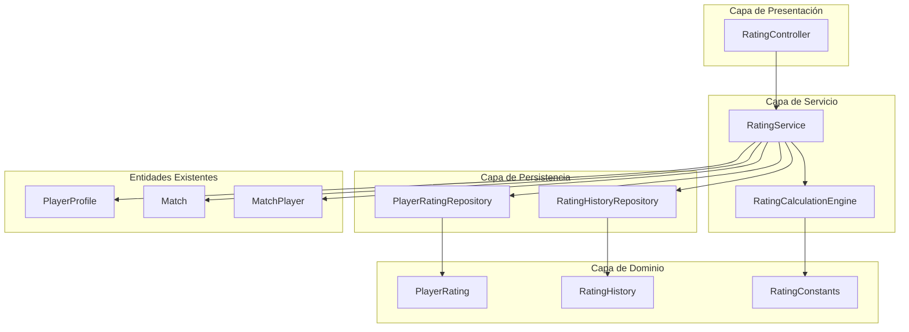
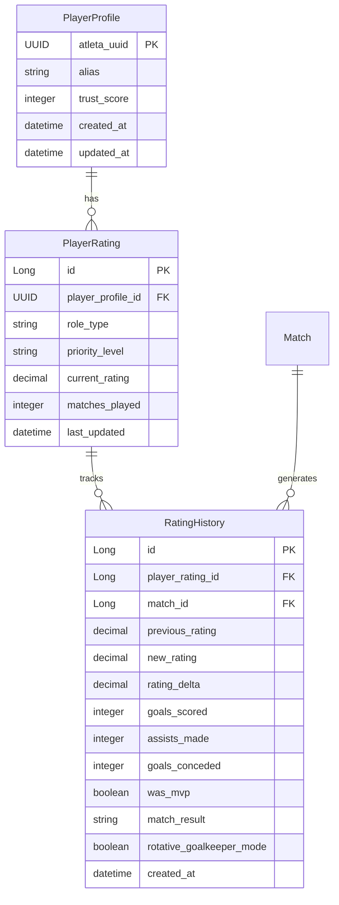

# Documento de Diseño: Sistema de Calificación de Jugadores

## Resumen

El Sistema de Calificación de Jugadores es un componente central que calcula y actualiza dinámicamente las calificaciones de los jugadores basándose en su rendimiento en partidos. El sistema implementa un algoritmo matemático preciso que considera múltiples factores: roles de jugadores, niveles de prioridad, resultados de partidos, métricas de rendimiento individual, bonos defensivos y reconocimiento MVP.

## Arquitectura

### Arquitectura General



### Componentes Principales

1. **RatingService**: Servicio principal que orquesta el cálculo de calificaciones
2. **RatingCalculationEngine**: Motor de cálculo que implementa la lógica matemática
3. **PlayerRating**: Entidad que almacena las calificaciones actuales por rol y prioridad
4. **RatingHistory**: Entidad que mantiene el historial de cambios de calificación
5. **RatingConstants**: Enums y constantes que definen pesos, multiplicadores y valores base

## Componentes e Interfaces

### 1. Enumeraciones y Constantes

```java
public enum RoleType {
    ATAQUE(1.0, 0.6),
    DEFENSA(0.3, 0.3),
    MEDIOCAMPO(0.6, 1.0),
    CARRILERO(0.5, 0.7), // Incluye laterales izquierdo y derecho
    ARQUERO(0.1, 0.0),
    DT(0.2, 0.2);
    
    private final double goalWeight;
    private final double assistWeight;
}

public enum PriorityLevel {
    PRINCIPAL(70, 1.0),
    SECUNDARIA(60, 0.7),
    TERCIARIA(50, 0.4);
    
    private final int baseRating;
    private final double multiplier;
}

public enum MatchResultType {
    GANADO(2.0, 1.5),
    EMPATE(0.5, 0.3),
    PERDIDO(-1.5, -1.2);
    
    private final double normalPoints;
    private final double rotativeGoalkeeperPoints;
}
```

### 2. Entidad PlayerRating

```java
@Entity
@Table(name = "player_ratings")
public class PlayerRating extends BaseEntity {
    
    @ManyToOne(fetch = FetchType.LAZY)
    @JoinColumn(name = "player_profile_id", nullable = false)
    private PlayerProfile playerProfile;
    
    @Enumerated(EnumType.STRING)
    @Column(name = "role_type", nullable = false)
    private RoleType roleType;
    
    @Enumerated(EnumType.STRING)
    @Column(name = "priority_level", nullable = false)
    private PriorityLevel priorityLevel;
    
    @Column(name = "current_rating", nullable = false, precision = 5, scale = 2)
    private BigDecimal currentRating;
    
    @Column(name = "matches_played", nullable = false)
    private Integer matchesPlayed = 0;
    
    @Column(name = "last_updated", nullable = false)
    private LocalDateTime lastUpdated;
}
```

### 3. Entidad RatingHistory

```java
@Entity
@Table(name = "rating_history")
public class RatingHistory extends BaseEntity {
    
    @ManyToOne(fetch = FetchType.LAZY)
    @JoinColumn(name = "player_rating_id", nullable = false)
    private PlayerRating playerRating;
    
    @ManyToOne(fetch = FetchType.LAZY)
    @JoinColumn(name = "match_id", nullable = false)
    private Match match;
    
    @Column(name = "previous_rating", nullable = false, precision = 5, scale = 2)
    private BigDecimal previousRating;
    
    @Column(name = "new_rating", nullable = false, precision = 5, scale = 2)
    private BigDecimal newRating;
    
    @Column(name = "rating_delta", nullable = false, precision = 5, scale = 2)
    private BigDecimal ratingDelta;
    
    @Column(name = "goals_scored", nullable = false)
    private Integer goalsScored;
    
    @Column(name = "assists_made", nullable = false)
    private Integer assistsMade;
    
    @Column(name = "goals_conceded")
    private Integer goalsConceded;
    
    @Column(name = "was_mvp", nullable = false)
    private Boolean wasMvp;
    
    @Enumerated(EnumType.STRING)
    @Column(name = "match_result", nullable = false)
    private MatchResultType matchResult;
    
    @Column(name = "rotative_goalkeeper_mode", nullable = false)
    private Boolean rotativeGoalkeeperMode = false;
}
```

### 4. Servicio Principal

```java
@Service
@Transactional
public class RatingService {
    
    private final RatingCalculationEngine calculationEngine;
    private final PlayerRatingRepository playerRatingRepository;
    private final RatingHistoryRepository ratingHistoryRepository;
    
    public void updatePlayerRatings(Long matchId, List<PlayerPerformanceDto> performances) {
        // Implementación principal
    }
    
    public void updateRotativeGoalkeeperRatings(Long matchId, MatchResultType result) {
        // Implementación para modo arquero rotativo
    }
    
    public List<PlayerRating> getPlayerRatings(UUID playerProfileId) {
        // Obtener calificaciones actuales
    }
    
    public List<RatingHistory> getRatingHistory(UUID playerProfileId, RoleType roleType) {
        // Obtener historial de calificaciones
    }
}
```

### 5. Motor de Cálculo

```java
@Component
public class RatingCalculationEngine {
    
    public BigDecimal calculateNewRating(RatingCalculationRequest request) {
        // Implementación del algoritmo principal
    }
    
    public BigDecimal calculateRotativeGoalkeeperRating(RotativeGoalkeeperRequest request) {
        // Implementación para arquero rotativo
    }
    
    private BigDecimal calculateDefensiveBonus(RoleType role, Integer goalsConceded) {
        // Cálculo de bonos defensivos
    }
    
    private BigDecimal applyPriorityMultiplier(BigDecimal delta, PriorityLevel priority) {
        // Aplicación de multiplicadores
    }
    
    private BigDecimal enforceMinimumRating(BigDecimal newRating, PriorityLevel priority) {
        // Aplicación de límites mínimos
    }
}
```

## Modelos de Datos

### Diagrama de Entidades



### DTOs de Transferencia

```java
public class PlayerPerformanceDto {
    private UUID playerProfileId;
    private RoleType roleType;
    private PriorityLevel priorityLevel;
    private Integer goalsScored;
    private Integer assistsMade;
    private Integer goalsConceded; // Solo para DEFENSA y ARQUERO
    private Boolean wasMvp;
    private MatchResultType matchResult;
}

public class RatingCalculationRequest {
    private BigDecimal currentRating;
    private RoleType roleType;
    private PriorityLevel priorityLevel;
    private MatchResultType matchResult;
    private Integer goalsScored;
    private Integer assistsMade;
    private Integer goalsConceded;
    private Boolean wasMvp;
}

public class RotativeGoalkeeperRequest {
    private BigDecimal currentGoalkeeperRating;
    private PriorityLevel goalkeeperPriority;
    private MatchResultType matchResult;
}
```

## Propiedades de Corrección

*Una propiedad es una característica o comportamiento que debe mantenerse verdadero a través de todas las ejecuciones válidas de un sistema - esencialmente, una declaración formal sobre lo que el sistema debe hacer. Las propiedades sirven como el puente entre las especificaciones legibles por humanos y las garantías de corrección verificables por máquina.*

### Propiedad 1: Validación de Roles y Prioridades
*Para cualquier* entrada al sistema de calificación, solo deben aceptarse exactamente los cinco roles definidos (ATAQUE, DEFENSA, MEDIOCAMPO, CARRILERO, ARQUERO, DT) y los tres niveles de prioridad (Principal, Secundaria, Terciaria)
**Valida: Requerimientos 1.1, 2.1**

### Propiedad 2: Aplicación Correcta de Pesos por Rol
*Para cualquier* cálculo de calificación, los goles y asistencias deben multiplicarse por los pesos específicos correctos según el rol del jugador
**Valida: Requerimientos 1.2, 4.1, 4.2**

### Propiedad 3: Bonos Defensivos Correctos
*Para cualquier* jugador con rol DEFENSA o ARQUERO, el bono defensivo aplicado debe corresponder exactamente a la cantidad de goles recibidos según las tablas definidas
**Valida: Requerimientos 1.3, 5.1, 5.2, 5.3, 5.4, 5.5, 5.6, 5.7**

### Propiedad 4: Valores Constantes del Sistema
*Para cualquier* cálculo en el sistema, todos los valores constantes (pesos de roles, multiplicadores de prioridad, puntos de resultado, bonos) deben coincidir exactamente con los valores especificados en los requerimientos
**Valida: Requerimientos 1.4, 1.5, 2.3, 3.1, 3.2, 3.3, 5.1, 5.2, 5.3, 5.4, 5.5, 5.6, 6.1, 7.2**

### Propiedad 5: Aplicación de Límites Mínimos
*Para cualquier* calificación calculada que resulte menor al mínimo base de su nivel de prioridad, la calificación final debe establecerse exactamente al valor mínimo base
**Valida: Requerimientos 2.2, 2.5, 8.4**

### Propiedad 6: Aplicación Universal de Puntos de Resultado
*Para cualquier* conjunto de jugadores en un partido, todos deben recibir los mismos puntos de resultado independientemente de su rol
**Valida: Requerimientos 3.5**

### Propiedad 7: Validación de Entrada
*Para cualquier* entrada al sistema, los valores de goles y asistencias deben ser enteros no negativos, y el estatus MVP debe ser booleano
**Valida: Requerimientos 4.4, 6.3**

### Propiedad 8: Restricción de MVP Único
*Para cualquier* partido, debe permitirse exactamente un jugador designado como MVP
**Valida: Requerimientos 6.4**

### Propiedad 9: Aplicación Universal de Bono MVP
*Para cualquier* jugador designado como MVP, debe recibir el bono MVP independientemente de su rol
**Valida: Requerimientos 6.5**

### Propiedad 10: Comportamiento de Arquero Rotativo
*Para cualquier* partido en modo arquero rotativo, todos los jugadores deben recibir actualizaciones de calificación de arquero con puntos de resultado modificados
**Valida: Requerimientos 7.1, 7.3, 7.4, 7.5**

### Propiedad 11: Algoritmo Principal de Cálculo
*Para cualquier* conjunto de datos de entrada válidos, el algoritmo debe calcular el delta sumando todos los componentes (resultado + goles ponderados + asistencias ponderadas + bono defensivo + bono MVP), aplicar el multiplicador de prioridad, sumar a la calificación actual, y aplicar límites mínimos en ese orden exacto
**Valida: Requerimientos 8.1, 8.2, 8.3, 8.5, 8.6, 2.4, 3.4, 4.5, 5.8, 6.2**

### Propiedad 12: Persistencia y Relaciones de Datos
*Para cualquier* actualización de calificación, debe crearse un registro en PlayerRating asociado al PlayerProfile correcto y un registro de historial en RatingHistory vinculado al partido y rol específicos
**Valida: Requerimientos 9.1, 9.2, 9.3**

### Propiedad 13: Validación de Datos Requeridos
*Para cualquier* intento de cálculo de calificación, todos los datos de entrada requeridos (jugador, rol, prioridad, resultado del partido) deben estar presentes y ser válidos antes de proceder
**Valida: Requerimientos 9.4**

## Manejo de Errores

### Estrategias de Manejo de Errores

1. **Validación de Entrada**
   - Validar que todos los parámetros requeridos estén presentes
   - Verificar que los valores numéricos estén en rangos válidos
   - Confirmar que los enums sean valores válidos

2. **Errores de Datos**
   - Manejar casos donde el PlayerProfile no existe
   - Gestionar situaciones donde el Match no está disponible
   - Validar que las relaciones entre entidades sean consistentes

3. **Errores de Cálculo**
   - Manejar overflow/underflow en cálculos decimales
   - Gestionar divisiones por cero (aunque no aplica en este algoritmo)
   - Validar que los resultados estén en rangos esperados

4. **Errores de Concurrencia**
   - Implementar optimistic locking en PlayerRating
   - Manejar conflictos de actualización simultánea
   - Retry logic para operaciones fallidas por concurrencia

### Excepciones Personalizadas

```java
public class RatingCalculationException extends RuntimeException {
    public RatingCalculationException(String message) { super(message); }
    public RatingCalculationException(String message, Throwable cause) { super(message, cause); }
}

public class InvalidPlayerDataException extends RatingCalculationException {
    public InvalidPlayerDataException(String message) { super(message); }
}

public class ConcurrentRatingUpdateException extends RatingCalculationException {
    public ConcurrentRatingUpdateException(String message) { super(message); }
}
```

## Estrategia de Testing

### Enfoque Dual de Testing

El sistema utilizará tanto **pruebas unitarias** como **pruebas basadas en propiedades** para lograr una cobertura integral:

- **Pruebas unitarias**: Verifican ejemplos específicos, casos límite y condiciones de error
- **Pruebas basadas en propiedades**: Verifican propiedades universales a través de todos los inputs
- Juntas proporcionan cobertura integral (las pruebas unitarias detectan bugs concretos, las pruebas de propiedades verifican corrección general)

### Configuración de Property-Based Testing

- **Framework**: jqwik (ya configurado en el proyecto)
- **Iteraciones mínimas**: 100 iteraciones por prueba de propiedad
- **Formato de etiquetas**: **Feature: player-rating-system, Property {número}: {texto de propiedad}**
- Cada propiedad de corrección debe implementarse mediante UNA SOLA prueba basada en propiedades
- Cada prueba de propiedad debe referenciar su propiedad del documento de diseño

### Balance de Pruebas Unitarias

- Las pruebas unitarias son útiles para ejemplos específicos y casos límite
- Evitar escribir demasiadas pruebas unitarias - las pruebas basadas en propiedades manejan la cobertura de muchos inputs
- Las pruebas unitarias deben enfocarse en:
  - Ejemplos específicos que demuestren comportamiento correcto
  - Puntos de integración entre componentes
  - Casos límite y condiciones de error
- Las pruebas de propiedades deben enfocarse en:
  - Propiedades universales que se mantienen para todos los inputs
  - Cobertura integral de inputs a través de aleatorización

### Generadores de Datos para Testing

```java
@Provide
Arbitrary<RoleType> roleTypes() {
    return Arbitraries.of(RoleType.class);
}

@Provide
Arbitrary<PriorityLevel> priorityLevels() {
    return Arbitraries.of(PriorityLevel.class);
}

@Provide
Arbitrary<PlayerPerformanceDto> playerPerformances() {
    return Combinators.combine(
        Arbitraries.create(UUID::randomUUID),
        roleTypes(),
        priorityLevels(),
        Arbitraries.integers().between(0, 10), // goals
        Arbitraries.integers().between(0, 10), // assists
        Arbitraries.integers().between(0, 5),  // goals conceded
        Arbitraries.booleans(),                // MVP status
        Arbitraries.of(MatchResultType.class)
    ).as(PlayerPerformanceDto::new);
}

@Provide
Arbitrary<BigDecimal> currentRatings() {
    return Arbitraries.bigDecimals()
        .between(BigDecimal.valueOf(40), BigDecimal.valueOf(100))
        .ofScale(2);
}
```